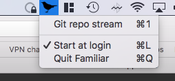
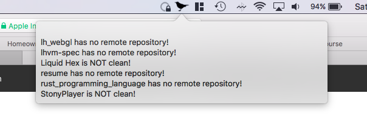

#  Familiar
#### Status bar runner for LHVM-based programs

## It goes like this:

#### Familiar is a little bird that lives in your status bar...

#### It waits for changes to your wifi network, sleep/wake status, or for you to manually click a button in its menu...

#### It checks the git repos in the target directory for uncommited changes, missing remotes, and other issues.

## What does this do?

It runs LHVM programs that target macOS, making available several Receptors and Perceptors that are specific to Familiar:

- Status bar UI inputs
- Status bar UI text outputs
